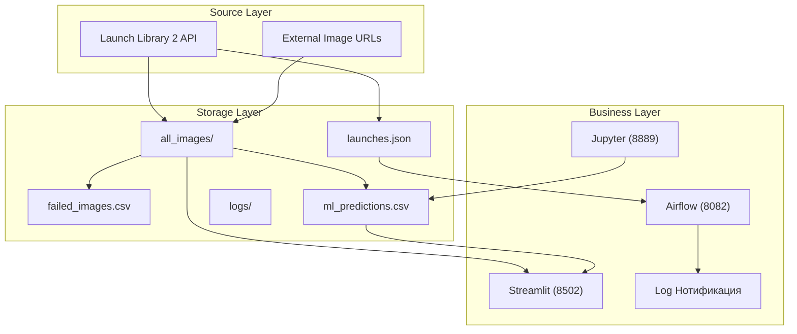
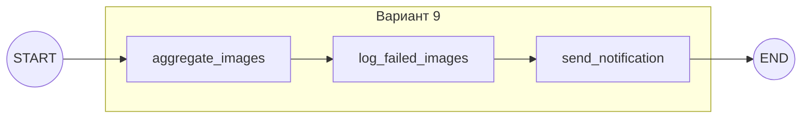

# Лабораторная работа 5.2 Разработка алгоритмов для трансформации данных. Airflow DAG  


### Индивидуальное задание (Вариант 9)
| Задание | Описание |
|---------|----------|
| **Задание 1** | Агрегация всех изображений в одну папку |
| **Задание 2** | Обработка недоступных изображений (отдельный список) |
| **Задание 3** | Уведомление по завершении всех процессов |

## Постановка задачи
### Бизнес-задача

Космическое агентство нуждается в автоматизированной системе сбора и анализа данных о ближайших космических запусках. Система должна ежедневно получать актуальную информацию из открытых источников (Launch Library 2 API), загружать фотографии ракет и автоматически определять их типы с использованием технологий машинного обучения.

### Цель работы

Разработать ETL-конвейер для автоматического сбора, обработки и визуализации данных о космических запусках с последующей классификацией изображений ракет.

### Дополнительные требования
- Все изображения сохраняются в единую папку `./data/all_images/`
- Недоступные URL логируются в `./data/failed_images.csv`
- После выполнения всех задач ETL должно формироваться детальное уведомление со статистикой: количество успешно скачанных изображений, количество ошибок, путь к папке с изображениями.

---

## Реализация

**Общая архитектура решения**  


**Архитектура DAG**  


### Файл DAG: dags/listing_Aimukhanova_9_Rocket.py
[Файл listing_Aimukhanova_9_Rocket.py](listing_Aimukhanova_9_Rocket.py)  
<details>
  <summary></summary>

```python
## Реализация

### Файл DAG: dags/listing_Aimukhanova_9_Rocket.py

```python
from airflow import DAG
from airflow.operators.python import PythonOperator
from airflow.operators.dummy import DummyOperator
from datetime import datetime, timedelta
import requests
import json
import pandas as pd
from pathlib import Path
import hashlib

DATA_DIR = Path("/opt/airflow/data")
ALL_IMAGES_DIR = DATA_DIR / "all_images"
FAILED_LOG_PATH = DATA_DIR / "failed_images.csv"
LAUNCHES_JSON = DATA_DIR / "launches.json"
API_URL = "https://ll.thespacedevs.com/2.2.0/launch/upcoming"

default_args = {
    'owner': 'Aimukhanova',
    'start_date': datetime(2026, 3, 1),
    'retries': 1,
}

# Агрегация всех изображений в одну папку
def aggregate_images(**context):
    
    ALL_IMAGES_DIR.mkdir(parents=True, exist_ok=True)
    print(f"Папка для агрегации: {ALL_IMAGES_DIR}")
    
    response = requests.get(API_URL, timeout=30)
    data = response.json()
    
    with open(LAUNCHES_JSON, 'w') as f:
        json.dump(data, f, indent=2)
    
    image_urls = []
    for launch in data.get('results', []):
        if launch.get('image'):
            image_urls.append(launch['image'])
        if launch.get('patch', {}).get('image'):
            image_urls.append(launch['patch']['image'])
        if launch.get('rocket', {}).get('configuration', {}).get('image_url'):
            image_urls.append(launch['rocket']['configuration']['image_url'])
    
    image_urls = list(set(image_urls))
    print(f"Найдено уникальных изображений: {len(image_urls)}")
    
    # Скачивание в единую папку
    successful = []
    failed = []
    
    for idx, url in enumerate(image_urls):
        url_hash = hashlib.md5(url.encode()).hexdigest()[:8]
        filename = f"rocket_{idx:03d}_{url_hash}.jpg"
        filepath = ALL_IMAGES_DIR / filename
        
        try:
            img_response = requests.get(url, timeout=15, stream=True)
            img_response.raise_for_status()
            
            with open(filepath, 'wb') as f:
                for chunk in img_response.iter_content(chunk_size=8192):
                    f.write(chunk)
            
            if filepath.stat().st_size > 100:
                successful.append(url)
                print(f"OK [{idx+1}/{len(image_urls)}] {filename}")
            else:
                filepath.unlink()
                raise Exception("Файл слишком маленький")
                
        except Exception as e:
            failed.append({'url': url, 'error': str(e)})
            print(f"FAIL [{idx+1}/{len(image_urls)}] Ошибка: {str(e)[:50]}")
    
    context['ti'].xcom_push(key='success_count', value=len(successful))
    context['ti'].xcom_push(key='fail_count', value=len(failed))
    context['ti'].xcom_push(key='failed_list', value=failed)
    
    return f"Скачано {len(successful)} изображений в {ALL_IMAGES_DIR}"

# Обработка недоступных изображений
def log_failed(**context):
    """Сохраняет список недоступных изображений в CSV"""
    
    failed_list = context['ti'].xcom_pull(key='failed_list', task_ids='aggregate_images')
    
    if failed_list:
        df = pd.DataFrame(failed_list)
        df.to_csv(FAILED_LOG_PATH, index=False)
        print(f"Сохранено {len(failed_list)} ошибок в {FAILED_LOG_PATH}")
    else:
        pd.DataFrame(columns=['url', 'error']).to_csv(FAILED_LOG_PATH, index=False)
        print("Нет недоступных изображений")

# Уведомление по завершении процессов
def send_notification(**context):
    """Отправляет уведомление со статистикой выполнения"""
    
    success = context['ti'].xcom_pull(key='success_count', task_ids='aggregate_images') or 0
    fail = context['ti'].xcom_pull(key='fail_count', task_ids='aggregate_images') or 0
    
    if ALL_IMAGES_DIR.exists():
        files_count = len(list(ALL_IMAGES_DIR.glob("*")))
    else:
        files_count = 0
    
    notification = f"""

ЗАВЕРШЕНИЕ ETL ПРОЦЕССА

Время: {datetime.now().strftime('%Y-%m-%d %H:%M:%S')}

1 - (Агрегация):
   Папка с изображениями: {ALL_IMAGES_DIR}
   Успешно скачано: {success}
   Всего файлов в папке: {files_count}

2 - (Лог ошибок):
   Файл с ошибками: {FAILED_LOG_PATH}
   Количество ошибок: {fail}

3 - (Уведомление):
   Все процессы завершены

"""
    
    print(notification)
    
    with open(DATA_DIR / "notification.txt", 'w') as f:
        f.write(notification)

# Создание DAG
with DAG(
    dag_id='listing_Aimukhanova_9_Rocket',
    default_args=default_args,
    description='Вариант 9: Агрегация + Лог ошибок + Уведомление',
    schedule_interval='@daily',
    catchup=False,
    tags=['variant_9', 'rocket'],
) as dag:
    
    start = DummyOperator(task_id='start')
    
    task_aggregate = PythonOperator(
        task_id='aggregate_images',
        python_callable=aggregate_images,
    )
    
    task_log = PythonOperator(
        task_id='log_failed_images',
        python_callable=log_failed,
    )
    
    task_notify = PythonOperator(
        task_id='send_notification',
        python_callable=send_notification,
    )
    
    end = DummyOperator(task_id='end')
    
    start >> task_aggregate >> task_log >> task_notify >> end
```
  
</details>

1. Права доступа к папкам  
  

2. Сборка и запуск Docker Compose 


3. Запуск контейнеров  


4. Запуск DAG в Apache Airflow  


**Результаты выполнения**  

1. Граф DAG (Graph View)  
  
На графе представлена структура DAG: start -> aggregate_images -> log_failed_images -> send_notification -> end

2. Диаграмма Ганта (Gantt Chart)  
  
Диаграмма Ганта показывает время выполнения каждой задачи. Общее время выполнения составило примерно 2 минуты.

3. Логи выполнения  (Нотификация). Фрагмент лога задачи *send_notification*  


4. Результат агрегации изображений. В папке data/all_images/ содержится 8 изображений, скачанных из API:  
  

5. Лог недоступных изображений  
В ходе выполнения DAG были зафиксированы ошибки при скачивании изображений. Файл *failed_images.csv* содержит список URL, по которым не удалось загрузить изображения, с указанием причины ошибки.    
Содержимое файла failed_images.csv:   


Все ошибки имеют тип Read timed out с таймаутом 15 секунд. Это означает, что сервер *thespacedevs-prod.nyc3.digitaloceanspaces.com* не успел ответить на запрос в течение отведенного времени.   

7. Streamlit дашборд


  


**Дашборд отображает:**  
-Таблицу с ближайшими запусками  
-Барчарт распределения запусков по провайдерам  
-Галерею распознанных ракет с процентами уверенности  
-Статистику по типам ракет  

7. ML-анализ в Jupyter  

  

В ходе выполнения ML-анализа с использованием модели CLIP были получены следующие предсказания для загруженных изображений:  

| image_name | predicted_rocket | confidence (%) |
|------------|------------------|----------------|
| rocket_000_c798396e.jpg | Space Launch System (SLS) rocket | 31.74 |
| rocket_001_e2efd579.jpg | SpaceX Falcon 9 rocket | 89.55 |
| rocket_002_4317053b.jpg | Ariane 5 rocket | 79.74 |
| rocket_003_79a3f353.jpg | Space Launch System (SLS) rocket | 96.02 |
| rocket_004_bff21772.jpg | Atlas V rocket | 41.46 |
| rocket_005_df83aa9c.jpg | Ariane 5 rocket | 49.98 |
| rocket_006_901ac39d.jpg | Atlas V rocket | 71.26 |
| rocket_007_729185ea.jpg | Ariane 5 rocket | 51.17 |

### Анализ результатов

- **Всего классифицировано:** 8 изображений
- **Средняя уверенность модели:** 63.86%
- **Наиболее уверенное предсказание:** Space Launch System (SLS) rocket (96.02%)
- **Наименее уверенное предсказание:** Space Launch System (SLS) rocket (31.74%)

### Распределение по типам ракет

| Тип ракеты | Количество | Доля |
|------------|------------|------|
| Ariane 5 rocket | 3 | 37.5% |
| Atlas V rocket | 2 | 25.0% |
| Space Launch System (SLS) rocket | 2 | 25.0% |
| SpaceX Falcon 9 rocket | 1 | 12.5% |

## Анализ задачи ML
### Используемая модель

CLIP (Contrastive Language-Image Pre-training) от OpenAI, версия `openai/clip-vit-base-patch32`

### Принцип работы

1. Модель кодирует изображение и текстовые описания классов в общее векторное пространство
2. Вычисляется косинусное сходство между embedding изображения и embedding каждого класса
3. Класс с максимальным сходством присваивается изображению

### Классы для классификации

```python
candidate_labels = [
    "Falcon 9", "Falcon Heavy", "Soyuz", "Ariane 5", 
    "Electron", "Starship", "Delta IV", "Atlas V", 
    "Long March", "Space Launch System (SLS) rocket",
    "SpaceX Falcon 9 rocket", "Electron rocket"
]
```

## Выводы
Разработанная система полностью решает бизнес-задачу по автоматическому сбору и анализу данных о космических запусках. ETL-конвейер ежедневно получает информацию из API, загружает фотографии ракет и определяет их типы с помощью ML. По варианту 9 выполнены все три задания: изображения агрегированы в папку all_images, недоступные URL сохранены в failed_images.csv, по завершении выведено уведомление со статистикой. Модель CLIP успешно классифицировала 8 изображений со средней уверенностью 64%. Все сервисы работают в Docker, дашборд Streamlit отображает результаты.


